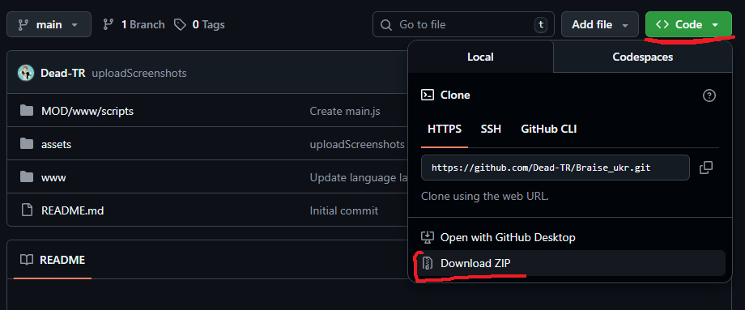
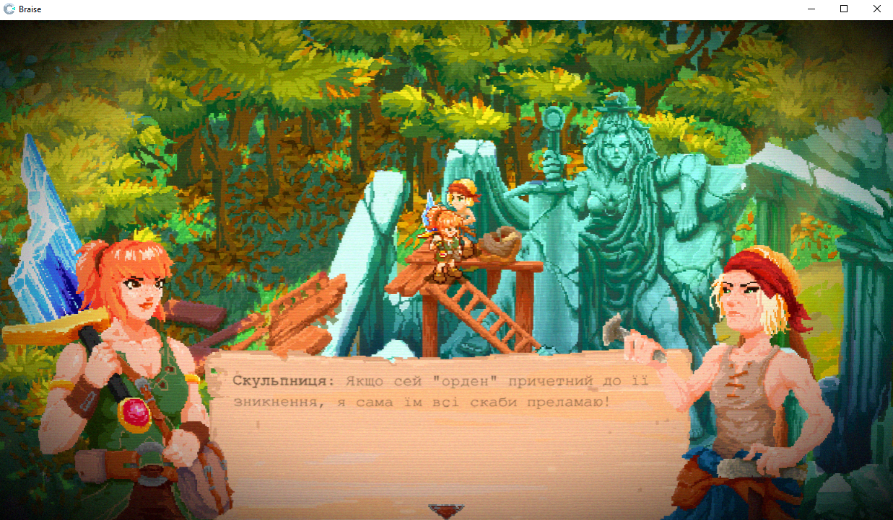
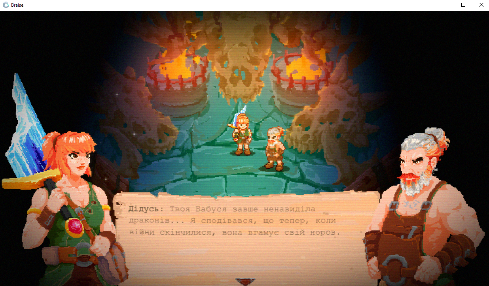
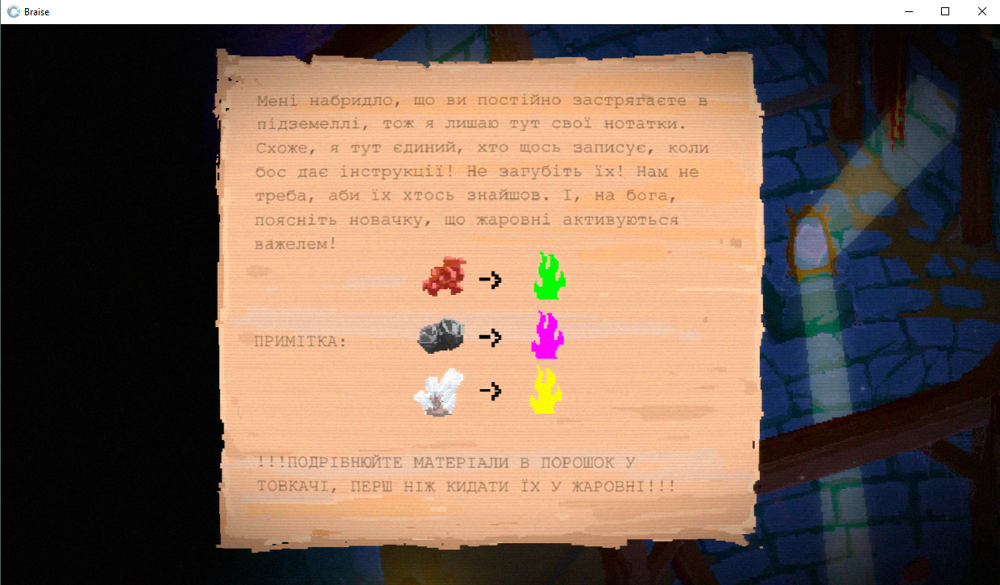
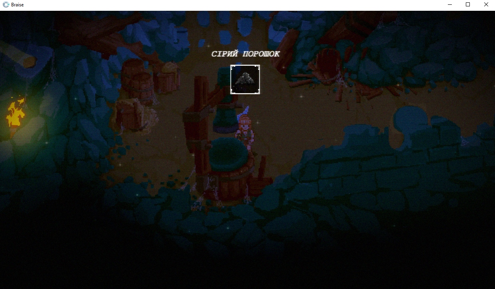
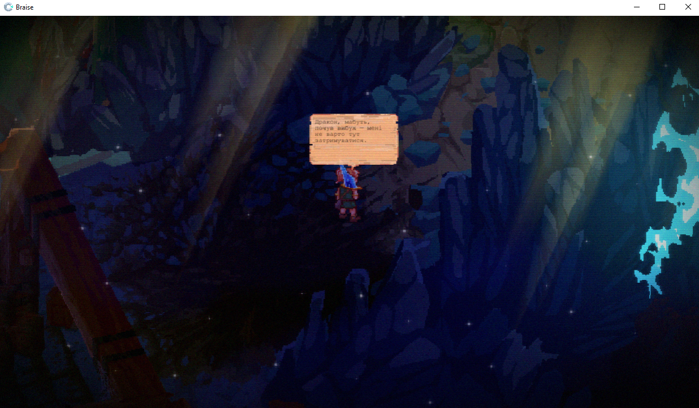
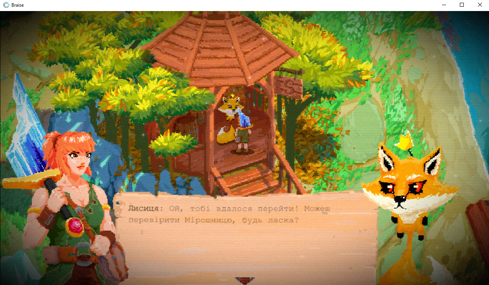
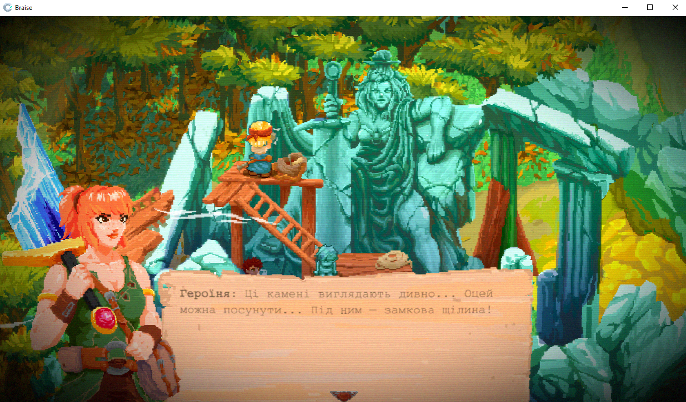

# Braise_ukr
 **Український переклад для гри Braise**

## Встановлення Перекладу
 - Спершу завантажте даний репозиторій.
   > `Code > Download ZIP`

 - Розпакуйте архів у корінь гри. Там де лежить файл запуску `Braise.exe`.
   > Типовий шлях: `SteamLibrary\steamapps\common\Braise\`
- Погодьтеся на заміну файлів

 ### Шрифт
 - За замовчуванням гра використовувала Pixel Art шрифт, але я не зміг підібрати зручний для читання піксельний шрифт українською. Тому я обрав `Nimbus Mono`.
 - Втім ви можете поексперементувати самостійно зі шрифтами та підібрати бажаний. В разі успіху, я навіть додам його до цього архіву.
   > [Pixel Art Шрифти Українською](https://www.ukrfonts.com/info/index.php?v=19&id=319)

## Опціональний Мод для геймпаду
 - За замовчуванням гра використовує японську розкладку клавіш для геймпаду. Тобто A == Відміна, а B == Підтвердження. Мені це здалося незручним, тому я зробив маленький мод, який міняє ці кнопки місцями.
 - Для встановлення ви можете скопіювати вміст папки `MOD` у корінь гри, або самостійно прописати необхідний код, [відповідно до інструкції](https://github.com/Dead-TR/Braise_ukr/tree/main/MOD/www/scripts#readme)

## Скріншоти Перекладу

